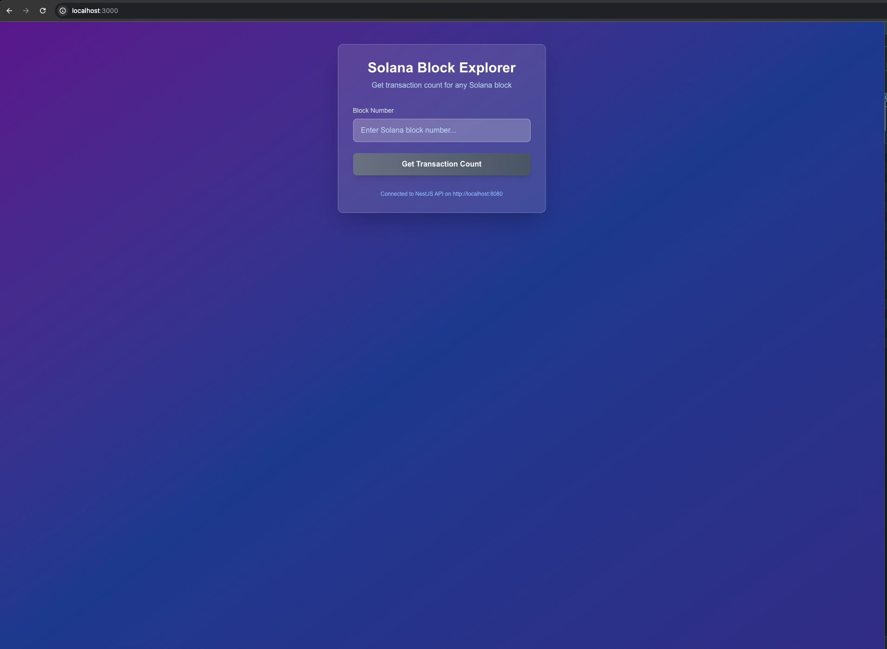
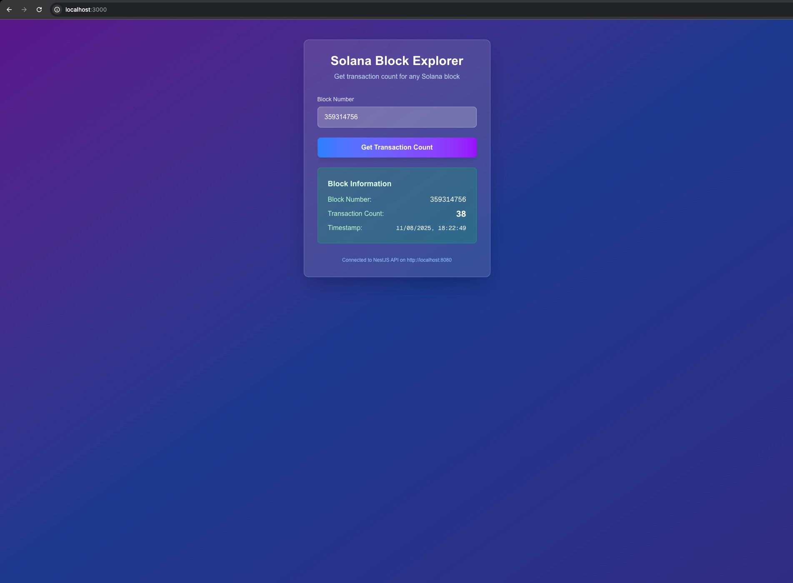

## Features

- Get transaction count for any Solana block number
- Health check endpoint
- Error handling with proper HTTP status codes
- CORS enabled for frontend integration
- Redis caching for improved performance

## Screenshots

### Initial State


_The application in its initial state, ready to accept block number queries_

### After Fetching Data


_The application displaying transaction count data for a queried Solana block_

## Environment Variables

Create a `.env` file based on `.env.example`:

## Installation

```bash
docker-compose --env-file .env.example up -d --build
```

This will start:

- **Backend API** on port 8080
- **Redis** on port 6379 for caching

## API Endpoints

### Get Transaction Count

```
GET /solana/block/{blockNumber}/transactions
```

**Parameters:**

- `blockNumber`: The Solana block number (positive integer)

**Response:**

```json
{
  "blockNumber": 123456789,
  "transactionCount": 2847,
  "timestamp": "2024-01-15T10:30:00.000Z"
}
```

**Example:**

```bash
curl http://localhost:3000/solana/block/250000000/transactions
```

### Health Check

```
GET /solana/health
```

**Response:**

```json
{
  "status": "healthy",
  "timestamp": "2024-01-15T10:30:00.000Z",
  "rpcEndpoint": "https://api.mainnet-beta.solana.com"
}
```

## Error Handling

The API returns appropriate HTTP status codes:

- `400 Bad Request`: Invalid block number
- `500 Internal Server Error`: Block not found or RPC errors
